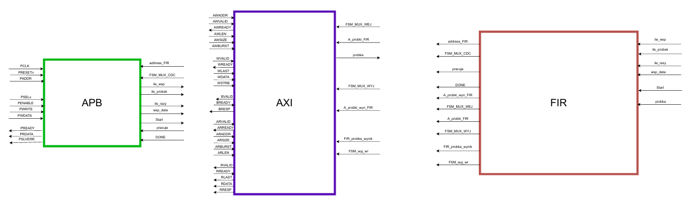

# Filtr FIR (APB + AXI, Dwie domeny zegarowe)

Projekt przedstawia implementację sprzętowego filtru cyfrowego FIR (Finite Impulse Response) w języku SystemVerilog. Układ wyposażony jest w interfejs APB do konfiguracji rejestrów i sterowania oraz interfejs AXI4 do transferu danych. Układ pracuje w dwóch niezależnych domenach zegarowych A i B.

Filtr obsługuje do 32 współczynników w formacie stałoprzecinkowym Q1.15 (16-bit, 2’s complement) oraz wykorzystuje wewnętrzne pamięci wejściowe i wyjściowe o rozmiarze 16 kB. Część arytmetyczna realizuje operację mnożenia i akumulacji z rozszerzoną precyzją oraz saturacją wyniku.

Projekt zawiera weryfikację funkcjonalną w środowisku cocotb z wykorzystaniem modelu referencyjnego w Pythonie, a także testy DSP obejmujące analizę odpowiedzi impulsowej, odpowiedzi na sinusoidę oraz charakterystyki częstotliwościowej i opóźnienia grupowego.

## Parametry filtru:

- Maksymalna liczba współczynników (taps): 32.
- Szerokość próbek: 16 bit w kodzie signed 2's complement (Q1.15).
- Szerokość danych AXI: 64 bit.
- Dane: tylko część rzeczywista.

## Część arytmetyczna:

1.  mnożenie: 16 bit × 16 bit → 31 bit,
2.  przesunięcie >> 15 bit (powrót do Q1.15),
3.  akumulacja w rozszerzonej precyzji (21 bit),
4.  saturacja do 16 bit.

## Domeny zegarowe:

- A: APB + rejestry konfiguracyjne.
- B: AXI + część arytmetyczna + pamięci.

# Struktura repozytorium

```
doc/             -> dokumentacja i schematy
src/             -> pliki SystemVerilog + proste TB
cocotb/          -> weryfikacja cocotb
modelFIR/        -> model referencyjny w w Pythonie
environment.yml  -> plik konfiguracyjny w formacie YAML dla środowiska conda
README.md        -> ten plik README
```

## Organizacja kodu

```
├── doc/
│   ├── PeBeeL_v2.9.pdf - dokumentacja.
│   ├── Schemat_PBL_.pdf - schemat RTL.
│   ├── Schemat_PBL__Podzial_Testy.pdf - podział schematu na części do testów.
│   └── Schemat_PBL__moduly_do_testow.pdf - sygnały do każdej z części.
│
├── src/
│   ├── tb/ - prosty tb
│   ├── .  - pliki źródłowe w SystemVerilog
│       .
│       .
│
├── cocotb/
│   ├── apb_testy/
│   ├── axi_testy/
│   ├── cdc_testy/
│   ├── fir_testy/
│   └── top_testy/
│
├── modelFIR/
│   └── model_fir.py - model referencyjny w Python
│
├── environment.yml
├── README.md
```

## Główne moduły projektu

- APB_main: APB3, CDC, Dekoder, MUX_Dekoder, MUX_CDC_wsp, Rejestry
  sterujące, RAM(wsp).

- AXI_main: AXI, MUX_AXI_wej, RAM wej, RAM wyj, MUX_AXI_wyj.

- FIR_main: FSM, Licznik, Licznik petli, Shift R, Acc, mnozenie, sumowanie.

<p align="center">
  <a href="doc/Schemat_PBL_ver_2_moduly_do_testow.pdf">
    
  </a>
  <br>
  <em>Rys 1. Główne moduły projektu.</em>
</p>

# Uruchomienie projektu

## Wymagania

- Python 3.10
- cocotb 1.9
- cocotb-bus
- cocotbext-apb : https://github.com/SystematIC-Design/cocotbext-apb.git
- Icarus Verilog
- Dla systemu Windows zalecana jest instalacja C++ Build Tools (wymaga tego wersja cocotb)

# Przeprowadzanie testów na Windows z Anaconda

Projekt wykorzystuje dedykowane środowisko Conda zdefiniowane w pliku:

```
environment.yml
```

Jeśli chcesz z niego skorzystać wykonaj ponizsze kroki.

## 1. Wymagania wstępne (instalowane ręcznie)

Zainstaluj:

- C++ Build Tools : https://visualstudio.microsoft.com/visual-cpp-build-tools/,
- Anaconda lub Miniconda,
- Icarus Verilog (iverilog).

Nastepnie sprawdź:

```
conda --version
iverilog -V
```

Jeśli polecenie nie działa, należy dodać katalog bin iverilog do zmiennej PATH.

## 2. Utworzenie środowiska Conda

Aby zaistalować środowisko, przejdź w terminalu do katalogu głównego projektu i wykonaj:

```
conda env create -f environment.yml
```

Zainstalowane zostaną m.in.:

- Python 3.10.19
- cocotb 1.9.0
- cocotb-bus
- numpy
- matplotlib
- inne wymagane zależności

## 3. Aktywacja środowiska

```
conda activate projectPBL
```

Teraz należy zainstalować bibliotekę cocotbext-apb, w tym celu wykonaj:

```
conda install git
git clone https://github.com/SystematIC-Design/cocotbext-apb.git
cd cocotbext-apb
python setup.py install
```

## 4. Weryfikacja instalacji

Sprawdzenie wersji Python:

```
python --version
```

Sprawdzenie cocotb:

```
pip show cocotb
```

Sprawdzenie symulatora:

```
iverilog -V
```

Sprawdzenie czy paczka cocotbext-apb jest widoczna:

```
pip list | Select-String cocotbext-apb
```

## 5. Uruchomienie testów

Aby uruchomić testy przejdź w terminalu do wybranego folderu testów z folderu cocotb:

```
cocotb/
 ├── apb_testy/
 ├── axi_testy/
 ├── cdc_testy/
 ├── fir_testy/
 └── top_testy/
```

Następnie wykonaj polecenie:

```
make SIM=icarus
```

Można też uruchomić tylko wybrany test, przykład:

```
make SIM=icarus WAVES=1 TESTCASE=axi_test_1
```
